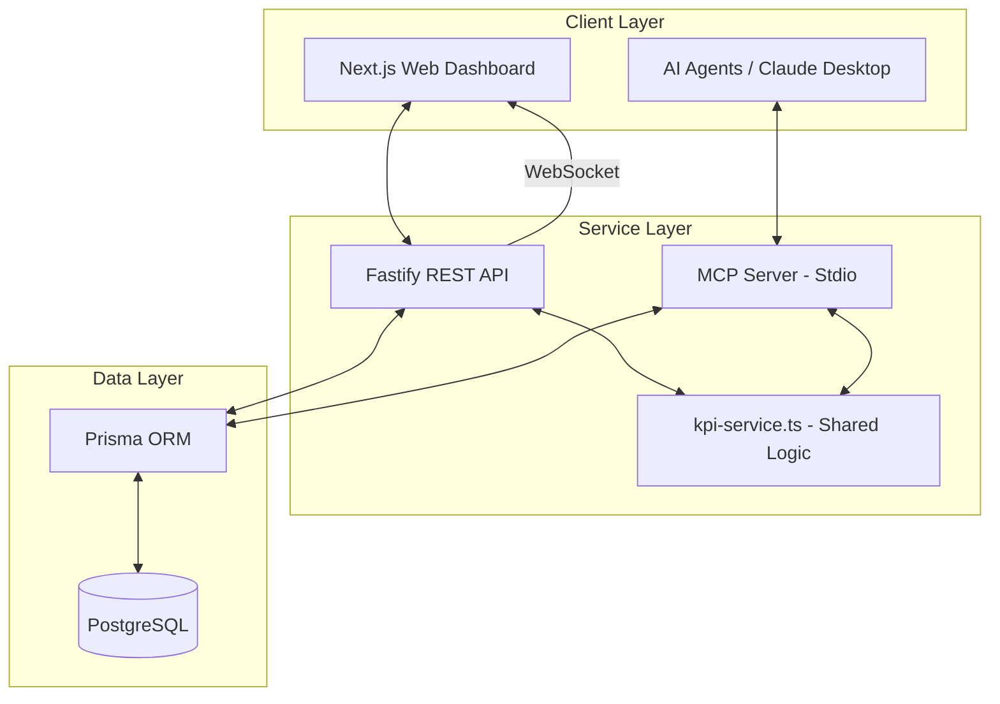
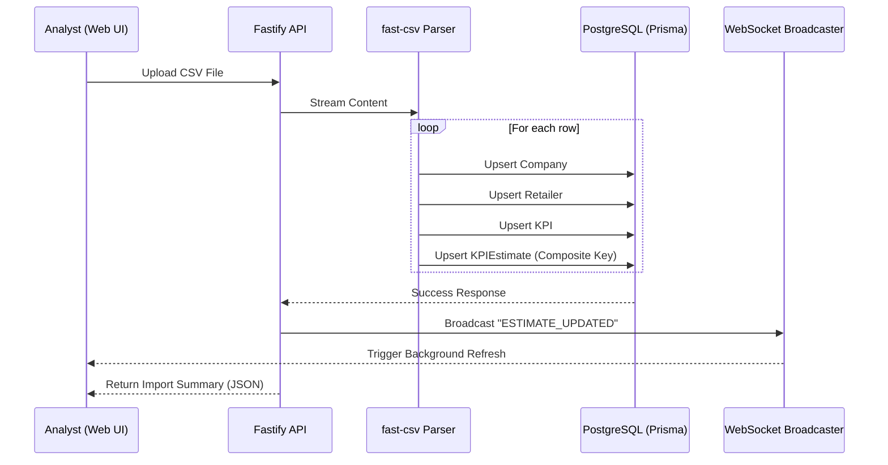
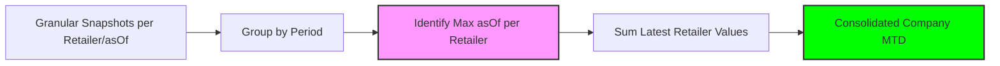
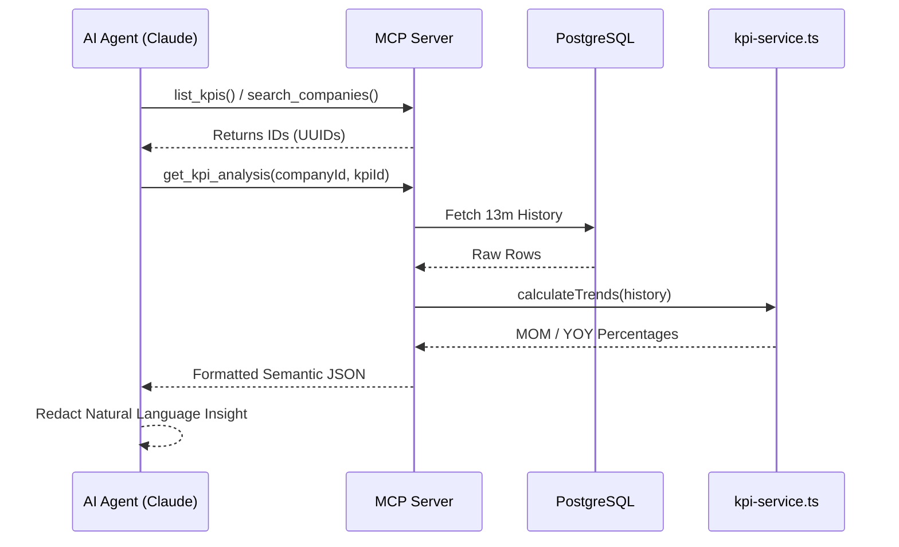

# System Architecture & Process Diagrams

This document provides visual representations of the system's architecture and its core analytical processes using Mermaid diagrams.

## 1. High-Level System Architecture
The ecosystem is organized as a Monorepo using **Turborepo**, ensuring shared types and a unified business logic layer.

### **Architectural Breakdown:**
- **Client Layer:** Supports multi-channel consumption. Human users interact via a rich Next.js dashboard, while AI agents consume data programmatically through the MCP server.
- **Service Layer:** Built on Fastify for high-performance I/O. Crucially, the **Shared Logic (`kpi-service.ts`)** is decoupled from the frameworks. This ensures that a "MOM Growth" percentage is calculated exactly the same way whether it's displayed on a chart or reported by an AI.
- **Data Layer:** PostgreSQL provides a relational foundation for complex aggregations, managed by Prisma ORM to ensure compile-time type safety across the entire monorepo.
- **Real-Time:** A WebSocket pipe connects the API to the Web client, enabling instant UI updates when data ingestion events occur.

---

## 2. Dynamic CSV Ingestion Pipeline
The ingestion process is designed to be data-agnostic, resolving entities in real-time.

### **Process Explanation:**
- **Streaming Ingestion:** The API doesn't load the entire file into memory; it streams it through `fast-csv`, making it resilient to multi-megabyte datasets.
- **Dynamic Entity Resolution:** The system performs an `upsert` for every reference entity (Company, Retailer, KPI). This means the system "learns" about new retailers or brands just by reading the file.
- **Idempotency:** By using a composite unique key in the `KPIEstimate` table, the system handles duplicate uploads gracefully, updating existing values rather than creating "phantom" data.
- **Async Feedback:** Once the database transaction is complete, a WebSocket broadcast ensures all open dashboard sessions refresh their charts immediately, providing a seamless "live data" feel.

---

## 3. MTD Aggregation Logic ("Latest-of-Many")
How the system resolves the current truth from multiple intra-month snapshots.

### **Logic Explanation:**
- **The Challenge:** MTD data is updated multiple times per day (`as_of` timestamp). Simply summing all rows for a month would lead to massive over-reporting.
- **The Resolution:** 
    1. The system groups data for the current month.
    2. For each unique **Retailer**, it performs a "Max Date" filter to find only the most recent snapshot.
    3. It then sums these "Latest Truths" across all retailers.
- **Outcome:** This ensures the dashboard always reflects the most current intra-month performance without losing the historical audit trail of how that number evolved.

---

## 4. MCP Semantic Layer Flow
How AI agents discover and analyze data without mathematical errors.

### **Flow Explanation:**
- **Semantic Bridge:** Instead of letting the AI guess IDs or calculate complex growth math, the MCP server acts as a **Business Intelligence Layer**.
- **Autonomous Discovery:** The agent first "explores" the environment via `search` and `list` tools to obtain valid UUIDs, mimicking how a human analyst would explore a database schema.
- **Pre-Calculated Ground Truth:** By calling the `kpi-service.ts` directly from the MCP handler, we provide the agent with pre-calculated, verified percentages.
- **Safety:** The agent never constructs raw SQL queries. It only interacts with high-level semantic tools, ensuring data integrity and preventing hallucinations.
