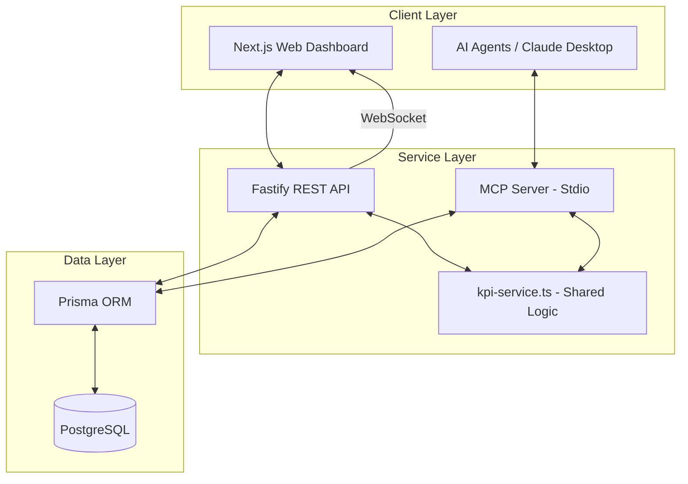
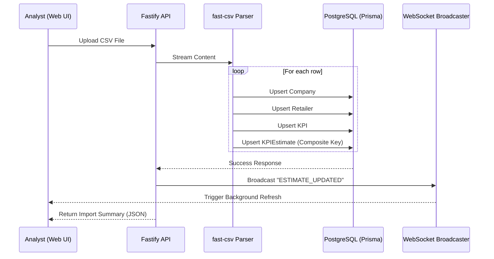
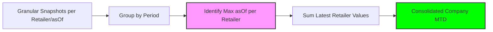
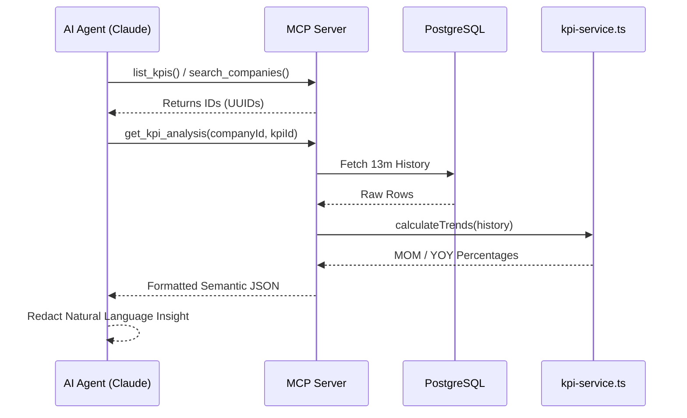

# System Architecture & Process Diagrams

This document provides visual representations of the system's architecture and its core analytical processes using Mermaid diagrams.

## 1. High-Level System Architecture
The ecosystem is organized as a Monorepo using **Turborepo**, ensuring shared types and a unified business logic layer.

## 2. Dynamic CSV Ingestion Pipeline
The ingestion process is designed to be data-agnostic, resolving entities in real-time.

## 3. MTD Aggregation Logic ("Latest-of-Many")
How the system resolves the current truth from multiple intra-month snapshots.

## 4. MCP Semantic Layer Flow
How AI agents discover and analyze data without mathematical errors.

